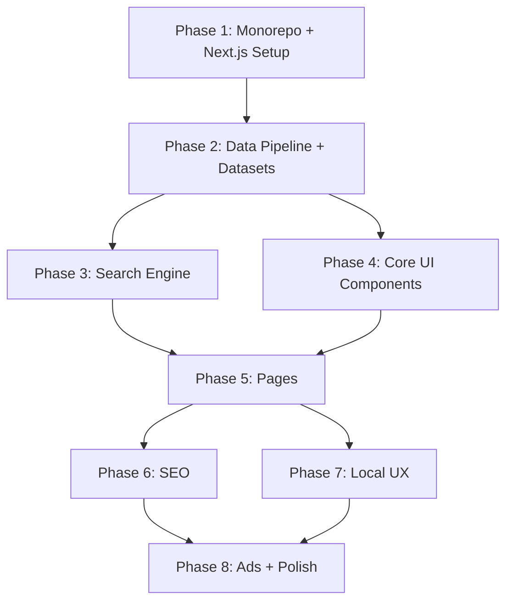

# CopyPaste Unicode — Implementation Plan

A fast, SEO-first monorepo website for searching, discovering, copying, and pasting emojis, symbols, kaomoji, and Unicode characters. Static-first, browser-first, no backend, no database.

## User Review Required

> [!IMPORTANT]
> **Tailwind CSS version**: The PRD specifies Tailwind CSS. Tailwind v4 is the current latest and has a different config model (CSS-based, no `tailwind.config.ts`). I'll use **Tailwind CSS v4** with the new CSS-based configuration unless you prefer v3.

> [!IMPORTANT]
> **shadcn/ui style**: shadcn/ui offers `default` and `new-york` styles. I'll use **new-york** for a more polished, premium feel. Let me know if you prefer default.

> [!WARNING]
> **Data scope for MVP**: The `unicode-emoji-json` package provides ~1,800 emoji. I'll add a curated symbols dataset (~300 items across hearts, arrows, stars, math, currency, shapes, etc.) and a curated kaomoji dataset (~200 items). The data pipeline scripts will be structured so you can expand later by plugging in full CLDR data. Building a full CLDR parser in Phase 1 would significantly delay MVP.

> [!IMPORTANT]
> **Ad placeholders**: For MVP, I'll create `<AdSlot />` components with reserved dimensions and placeholder styling. Actual ad network integration (Google AdSense etc.) will be wired in later since it requires account approval and live domains.

## Open Questions

> [!IMPORTANT]
> **Domain / Site Name**: The PRD uses "CopyPaste Unicode" as working name. Should I use this in all branding/metadata, or do you have a final brand name?

> [!IMPORTANT]  
> **Color Scheme Preference**: I'll design a modern dark-mode-first aesthetic with a vibrant accent color (likely a purple-to-blue gradient). Any specific color preferences or brand colors?

> [!IMPORTANT]
> **Deployment**: The plan assumes Vercel for deployment. Should I set up the Vercel project config, or just ensure the codebase is Vercel-ready?

---

## Proposed Changes

The implementation follows the 8 phases from the PRD. Here's the detailed breakdown:

---

### Phase 1 — Foundation (Monorepo Setup)

#### [NEW] Root monorepo configuration

Set up the pnpm + Turborepo monorepo with the following root files:

| File | Purpose |
|------|---------|
| `package.json` | Root workspace scripts, shared devDependencies |
| `pnpm-workspace.yaml` | Workspace package paths (`apps/*`, `packages/*`) |
| `turbo.json` | Turborepo pipeline (build, dev, lint, typecheck, test) |
| `tsconfig.json` | Root TypeScript config |
| `.gitignore` | Node, Next.js, Turbo cache ignores |
| `.prettierrc` | Prettier config |
| `.eslintrc.js` | Root ESLint config |

#### [NEW] `apps/web/` — Next.js App

Initialize with `create-next-app` inside the monorepo:
- Next.js (App Router)
- TypeScript
- Tailwind CSS v4
- ESLint
- `@/*` import alias

Then install and initialize shadcn/ui (new-york style, zinc base color, CSS variables enabled).

#### [NEW] `packages/types/` — Shared Types

```ts
// Core data types: CharacterType, CharacterItem, Category, SearchResult
export type CharacterType = "emoji" | "symbol" | "kaomoji";
export interface CharacterItem { ... }
```

#### [NEW] `packages/config/` — Shared Configs

Shared TypeScript, ESLint configs extended by all packages.

---

### Phase 2 — Data Pipeline

#### [NEW] `packages/data/` — Character Data Package

Contains the curated, validated character datasets:

| File | Content |
|------|---------|
| `src/emoji/data.json` | All emoji from `unicode-emoji-json`, enriched with keywords |
| `src/symbols/data.json` | Curated symbol sets (hearts, arrows, stars, math, currency, shapes, lines, music, weather, technical, Greek, Latin, misc) |
| `src/kaomoji/data.json` | Curated kaomoji (happy, sad, love, cute, angry, shrug, excited, animals, friends, table-flip, greetings) |
| `src/categories/index.ts` | Category definitions, slugs, metadata |
| `src/types.ts` | Re-exports from `@repo/types` |
| `src/index.ts` | Public API for data access |

#### [NEW] `scripts/` — Data Pipeline Scripts

| Script | Purpose |
|--------|---------|
| `fetch-emoji.ts` | Downloads latest `unicode-emoji-json` data |
| `build-symbols.ts` | Generates symbols dataset from curated source |
| `build-kaomoji.ts` | Generates kaomoji dataset from curated source |
| `normalize-data.ts` | Normalizes all data into `CharacterItem[]` format |
| `validate-data.ts` | Validates Unicode sequences, duplicate slugs/IDs, ZWJ, variation selectors |
| `generate-search-index.ts` | Builds the client-side search index |
| `build-data.ts` | Orchestrates the full pipeline |

**Validation checks:**
- Duplicate IDs / slugs
- Invalid Unicode codepoints
- Missing names
- Broken ZWJ sequences
- Variation selector correctness
- Malformed JSON
- Broken relatedIds references

Output: validated JSON files placed in `apps/web/public/data/` and `packages/data/src/`.

---

### Phase 3 — Search Engine

#### [NEW] `packages/search/` — Client-Side Search

A custom TypeScript search engine that runs entirely in the browser:

| File | Purpose |
|------|---------|
| `src/tokenizer.ts` | Query tokenization, normalization |
| `src/normalize.ts` | Text normalization (lowercase, diacritics, whitespace) |
| `src/ranking.ts` | Multi-factor ranking: exact name > exact alias > prefix > keyword > category > fuzzy |
| `src/search.ts` | Main search function, takes query + index, returns ranked results |
| `src/index.ts` | Public API |

**Search index format** (optimized for size):
```json
{
  "items": [...],       // CharacterItem[] (compact)
  "nameIndex": {...},   // name → item IDs
  "keywordIndex": {...} // keyword → item IDs  
}
```

**Search ranking priority:**
1. Exact name match
2. Exact alias match
3. Prefix match on name
4. Keyword match
5. Category match
6. Fuzzy match (Levenshtein distance ≤ 2)

Target: <100ms search on 2,000+ items, no API calls.

---

### Phase 4 — Core UI Components

#### [NEW] `apps/web/components/`

| Component | Type | Purpose |
|-----------|------|---------|
| `navigation/Navbar.tsx` | Server | Top navigation with logo, search trigger, category links, theme toggle |
| `navigation/Footer.tsx` | Server | Footer with links, legal pages |
| `search/SearchBox.tsx` | Client | Global search input with instant results, keyboard navigation |
| `search/SearchResults.tsx` | Client | Results grid below search |
| `search/SearchEmpty.tsx` | Server | Empty state with suggestions |
| `character/CharacterCard.tsx` | Client | Character display card with one-click copy |
| `character/CharacterGrid.tsx` | Server/Client | Responsive grid of CharacterCards |
| `character/CharacterDetail.tsx` | Server | Full detail view for a character |
| `copy/CopyButton.tsx` | Client | Copy button with `navigator.clipboard.writeText` + fallback |
| `copy/CopyFeedback.tsx` | Client | "✓ Copied" toast/animation |
| `favorites/FavoriteButton.tsx` | Client | Heart toggle, persists to localStorage |
| `ads/AdSlot.tsx` | Client | Reserved-dimension ad container |
| `ads/DesktopAd.tsx` | Client | Sidebar ad wrapper |
| `ads/MobileAd.tsx` | Client | Inline mobile ad wrapper |

**Client Components** (only these need `"use client"`):
- SearchBox, CopyButton, CopyFeedback, FavoriteButton, ThemeToggle, CharacterCard (for click-to-copy), AdSlot

Everything else is a React Server Component.

#### [NEW] `apps/web/lib/`

| Module | Purpose |
|--------|---------|
| `clipboard/index.ts` | Clipboard API wrapper with fallback + error handling |
| `storage/index.ts` | localStorage wrapper: recent items (max 100), favorites (max 500), bounded + validated |
| `search/client.ts` | Client-side search integration, lazy-loads search index |
| `seo/metadata.ts` | Metadata generation helpers |
| `utils/index.ts` | Slug generation, formatting helpers |

---

### Phase 5 — Pages (App Router)

#### [NEW] `apps/web/app/` — Route Structure

```
app/
├── layout.tsx          ← Root layout: fonts, theme provider, navbar, footer
├── page.tsx            ← Homepage: hero search, popular categories, trending
├── emoji/
│   ├── page.tsx        ← All emoji categories overview
│   └── [slug]/
│       └── page.tsx    ← Individual emoji detail page
├── symbols/
│   ├── page.tsx        ← All symbol categories overview
│   └── [slug]/
│       └── page.tsx    ← Symbol category page (e.g., /symbols/heart)
├── kaomoji/
│   ├── page.tsx        ← All kaomoji categories overview
│   └── [slug]/
│       └── page.tsx    ← Kaomoji category page (e.g., /kaomoji/happy)
├── search/
│   └── page.tsx        ← Search results page (/search?q=heart)
├── about/
│   └── page.tsx        ← About page
├── privacy/
│   └── page.tsx        ← Privacy policy
├── terms/
│   └── page.tsx        ← Terms of service
├── sitemap.ts          ← Dynamic sitemap generation
├── robots.ts           ← Robots.txt generation
└── not-found.tsx       ← Custom 404 (lightweight)
```

**Static generation strategy:**
- `generateStaticParams()` for emoji detail pages, symbol category pages, kaomoji category pages
- Homepage, category overview pages: statically generated at build time
- Search page: client-side rendering (no SSR for search results), `noindex` meta
- Legal pages: static

**Page structure (SEO template):**
Each indexable page includes:
1. Title + H1
2. Short introduction paragraph
3. Character grid
4. Character information / Unicode details
5. Related characters section
6. Related categories (internal links)
7. FAQ section (where genuinely useful)

---

### Phase 6 — SEO Infrastructure

#### [MODIFY] All page files

Every indexable page gets:

| Element | Implementation |
|---------|---------------|
| `generateMetadata()` | Dynamic title, description with Unicode characters in title |
| Canonical URL | `<link rel="canonical">` via metadata API |
| Open Graph | og:title, og:description, og:image, og:url |
| Twitter Card | twitter:card, twitter:title, twitter:description |
| Structured Data | JSON-LD for relevant pages |

#### [NEW] `apps/web/app/sitemap.ts`

Generates `/sitemap.xml` containing only:
- `/` (homepage)
- `/emoji` (emoji overview)
- `/emoji/[slug]` (each emoji detail page — only high-value ones)
- `/symbols` (symbols overview)
- `/symbols/[slug]` (each symbol category)
- `/kaomoji` (kaomoji overview)
- `/kaomoji/[slug]` (each kaomoji category)
- `/about`

**NOT included**: `/search?q=*`, legal pages (optional), low-value auto-generated pages.

#### [NEW] `apps/web/app/robots.ts`

```
User-agent: *
Allow: /
Disallow: /search
Sitemap: https://domain.com/sitemap.xml
```

---

### Phase 7 — Local UX Features

#### [MODIFY] `apps/web/lib/storage/`

**Recently Copied:**
- Stores last 100 copied items in localStorage
- Key: `copypaste:recent`
- FIFO eviction
- Handles: localStorage unavailable, quota exceeded, malformed data, private browsing

**Favorites:**
- Stores up to 500 favorited item IDs in localStorage  
- Key: `copypaste:favorites`
- Handles all edge cases gracefully

#### [NEW] Theme System (Dark Mode)

- Three modes: light, dark, system
- Uses `next-themes` for SSR-safe theme switching
- Stored in localStorage, no server-side preference
- Theme toggle in Navbar

#### Keyboard Navigation

- Search: Arrow keys to navigate results, Enter to copy, Escape to close
- Character grid: Tab navigation, Enter to copy
- All interactive elements keyboard accessible

---

### Phase 8 — Ads & Monetization

#### [NEW] Ad Components

```
components/ads/
├── AdSlot.tsx       ← Generic ad container with reserved dimensions
├── DesktopAd.tsx    ← Sidebar ad (300×250, 160×600)
└── MobileAd.tsx     ← Inline ad (320×100, 300×250)
```

**Requirements:**
- Reserved dimensions to prevent CLS
- Lazy-load below-the-fold ads
- Graceful failure (ad network down → empty reserved slot)
- No impact on core functionality

**Desktop layout:**
```
┌────────┐ ┌──────────────────┐ ┌────────┐
│  AD    │ │     CONTENT      │ │  AD    │
│ 160×600│ │                  │ │ 300×250│
└────────┘ └──────────────────┘ └────────┘
```

**Mobile layout:** Inline ads between content sections.

---

## File Summary

| Category | New Files | Modified Files |
|----------|-----------|----------------|
| Root config | ~8 | 0 |
| `packages/types` | ~3 | 0 |
| `packages/config` | ~4 | 0 |
| `packages/data` | ~10 | 0 |
| `packages/search` | ~6 | 0 |
| `scripts/` | ~7 | 0 |
| `apps/web/components` | ~15 | 0 |
| `apps/web/lib` | ~8 | 0 |
| `apps/web/app` pages | ~15 | 0 |
| `apps/web/styles` | ~2 | 0 |
| **Total** | **~78** | **0** |

---

## Execution Order

I'll build in this sequence to ensure each phase has working foundations:



---

## Verification Plan

### Automated Tests

```bash
# Unit tests (Vitest)
pnpm test

# Tests cover:
# - Search ranking algorithm
# - Unicode codepoint parsing
# - Slug generation
# - Data validation
# - localStorage wrapper
# - Clipboard utility
```

```bash
# Build verification
pnpm build

# Ensures:
# - TypeScript compiles
# - Static pages generate
# - Search index builds
# - No SSR errors
```

### Manual Verification

1. **Homepage** loads with search, categories, popular characters
2. **Search** returns instant results for "heart", "arrow", "smile", "love"
3. **Copy** works on Chrome, Firefox, Edge (desktop + mobile)
4. **Dark mode** toggle works and persists
5. **Category pages** render full grids with copy functionality
6. **Detail pages** show Unicode info, related characters
7. **Mobile** responsive at all breakpoints
8. **404** is lightweight and renders correctly
9. **Sitemap** generates valid XML with only quality URLs
10. **CLS** < 0.1 (ad slots have reserved dimensions)
